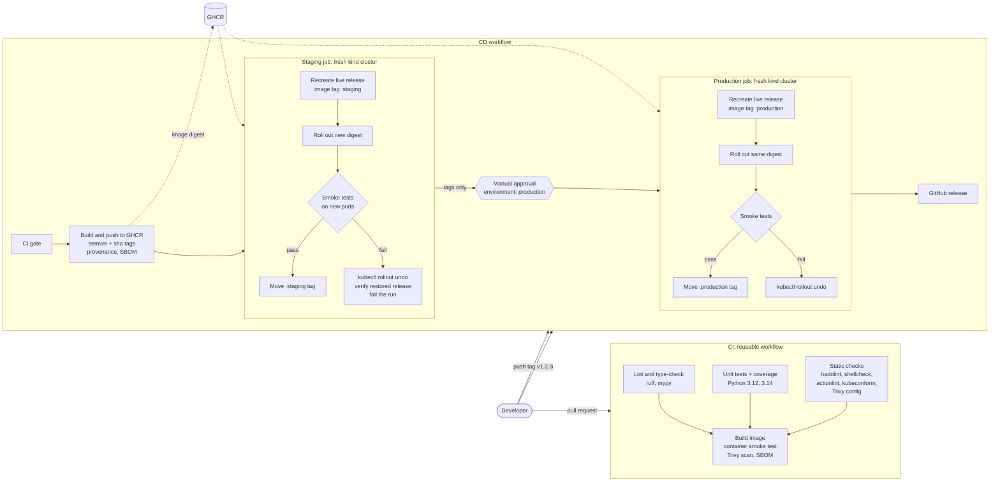
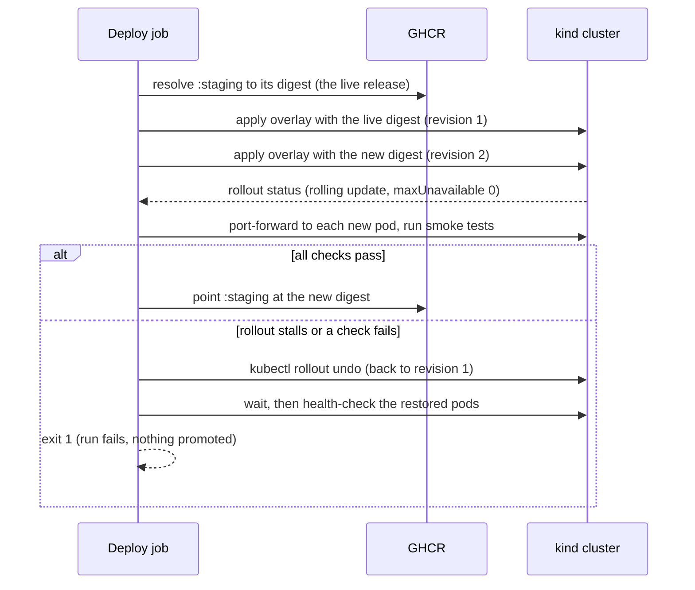

# Automated CI/CD Pipeline for Containerised Applications

[](https://github.com/Omith786/Automated-CI-CD-Pipeline-for-Containerized-Applications/actions/workflows/cd.yml)
[](https://github.com/Omith786/Automated-CI-CD-Pipeline-for-Containerized-Applications/actions/workflows/ci.yml)
[](https://github.com/Omith786/Automated-CI-CD-Pipeline-for-Containerized-Applications/releases)
[](LICENSE)

An end-to-end CI/CD pipeline that takes a containerised application from a pull request to a verified production deployment with no manual steps apart from one approval. Every change is linted, type-checked and unit-tested, then built into a hardened container image. That image is smoke-tested, scanned for vulnerabilities and described by an SBOM. Merges to `main` publish the image to GitHub Container Registry and deploy it to a staging Kubernetes environment. Version tags promote the same image, byte for byte, to production behind a manual approval gate. If a rollout stalls or its smoke tests fail, the pipeline runs `kubectl rollout undo` on its own and checks that the previous release is healthy again. The aim is to take the repetitive, error-prone parts of shipping software away from developers while keeping releases traceable and reproducible. Everything runs on free tooling: GitHub Actions, GitHub Container Registry, and Kubernetes clusters created inside the workflow with [kind](https://kind.sigs.k8s.io/). No cloud account is needed.

The application being shipped is a small but real FastAPI service (great-circle distances between coordinates). It has the features a platform relies on: liveness and readiness probes, Prometheus metrics, structured JSON logs and configuration through environment variables. The pipeline is the main subject; the service exists so that there is something real to build, test, deploy and roll back.

## Contents

- [Features](#features)
- [Architecture](#architecture)
- [Pipeline stages](#pipeline-stages)
- [Branching and release strategy](#branching-and-release-strategy)
- [The sample service](#the-sample-service)
- [Project structure](#project-structure)
- [Tech stack](#tech-stack)
- [Getting started](#getting-started)
- [Forking and using the pipeline](#forking-and-using-the-pipeline)
- [Secrets and permissions](#secrets-and-permissions)
- [Watching an automatic rollback](#watching-an-automatic-rollback)
- [Testing](#testing)
- [Design decisions](#design-decisions)
- [Limitations and future work](#limitations-and-future-work)

## Features

- **Continuous integration on every pull request**: ruff (lint and format), mypy in strict mode, and pytest with branch coverage (at least 90% required) on Python 3.12 and 3.14. Also hadolint for the Dockerfile, shellcheck for the scripts, actionlint for the workflows, and kubeconform against the rendered Kustomize output.
- **Hardened container image**: a multi-stage build on a digest-pinned `python:3.12-slim` base. It runs as a fixed non-root UID and works on a read-only root filesystem. It has a `HEALTHCHECK`, and an allow-list `.dockerignore` so only the application code reaches the build context.
- **Image verification before publishing**: the image is started with the same restrictions it gets in Kubernetes (read-only, all capabilities dropped). It must report healthy and pass the smoke tests. Trivy then fails the build on any fixable HIGH or CRITICAL vulnerability, and uploads its findings to GitHub code scanning. Trivy also scans the rendered manifests and the Dockerfile for misconfigurations. An SPDX SBOM is produced with Syft.
- **Registry publishing with traceable tags**: images go to GHCR tagged `sha-<commit>`, `main`, and for releases `1.2.3`, `1.2` and `latest`. Build provenance and an SBOM are attached in the registry.
- **Build once, promote the digest**: staging and production both deploy the immutable `repository@sha256:...` produced earlier in the same run, never a rebuilt image or a mutable tag.
- **Kubernetes manifests with Kustomize**: a `base` plus `staging` and `production` overlays. They define a Deployment with startup, liveness and readiness probes, requests and limits, a zero-downtime rolling update strategy and a preStop drain. Alongside it: a Service, a HorizontalPodAutoscaler, a PodDisruptionBudget, a token-less ServiceAccount, and a hash-suffixed ConfigMap, so a config change triggers a rollout of its own. Both namespaces enforce the Pod Security "restricted" standard.
- **Real deployments in kind**: each environment is a fresh kind cluster. It is rebuilt with the release currently live there (tracked by a moving `staging` or `production` image tag), and then the new release is rolled over it.
- **Smoke tests against the new pods only**: every pod of the new revision is tested through its own port-forward. The tests confirm it reports the expected version and environment, returns correct answers, rejects bad input and exposes metrics. They also check that the Service routes to those pods.
- **Automatic rollback**: if the rollout stalls or any smoke check fails, `kubectl rollout undo` restores the previous revision. The pipeline waits for it and re-verifies the restored release. The run is still marked failed, so nothing is promoted or tagged.
- **Manual approval for production**: the production job uses a GitHub `environment`, so it waits for a required reviewer before deploying.
- **GitHub release** for each version tag, with the verified image digest and the SBOM attached.
- **Dependabot** for Python packages, the Docker base image, the compose file and every pinned GitHub Action. All third-party actions are pinned to full commit SHAs.
- **Reusable building blocks**: CI is a reusable workflow that CD calls, so the same gate protects pull requests and releases. Four composite actions (`setup-python-env`, `setup-tools`, `kind-deploy`, `promote`) remove the duplication between jobs.
- **A Makefile that mirrors the pipeline**, so every stage can be run locally with the same tool versions.

## Architecture



What happens inside each deployment job (`scripts/deploy.sh`):



## Pipeline stages

| Stage | Workflow / job | Trigger | What it does | Fails the run when |
|---|---|---|---|---|
| Lint and type-check | `ci.yml` / `lint` | PR, weekly, called by CD | `ruff check`, `ruff format --check`, `mypy --strict` | any lint, format or type error |
| Unit tests | `ci.yml` / `test` | as above | pytest on Python 3.12 and 3.14, branch coverage, JUnit and coverage reports | a test fails or coverage drops below 90% |
| Static validation | `ci.yml` / `static` | as above | hadolint, shellcheck, actionlint, `kustomize build` + `kubeconform -strict`, Trivy misconfiguration scan | any finding (Trivy: HIGH or CRITICAL) |
| Image verification | `ci.yml` / `image` | as above | build image, run it hardened, wait for `HEALTHCHECK`, smoke tests, Trivy image scan (SARIF to code scanning), SPDX SBOM | unhealthy container, failed smoke check, fixable HIGH/CRITICAL CVE |
| Publish | `cd.yml` / `publish` | push to `main`, tag `v*.*.*` | build and push to GHCR with semver/sha tags, provenance and SBOM attestations, SBOM artifact | build or push error |
| Staging | `cd.yml` / `staging` | after publish | fresh kind cluster, recreate live staging release, deploy new digest, smoke tests, automatic rollback, move `:staging` tag | rollout stalls or smoke tests fail (after rolling back) |
| Production | `cd.yml` / `production` | tags only, after staging, **manual approval** | same flow with the production overlay and the same digest, move `:production` tag | as for staging |
| Release | `cd.yml` / `release` | after production | GitHub release with automatic release notes, image digest and SBOM | |

## Branching and release strategy

The repository uses trunk-based development:

- **Feature branches and pull requests.** All work happens on short-lived branches. Opening a pull request runs the full CI workflow. Protect `main` in the repository settings so that the CI jobs are required checks and changes cannot be pushed directly.
- **`main` is always deployable.** Every merge to `main` runs CI again (as the first job of CD), publishes an image tagged `sha-<commit>` and `main`, and deploys it to staging. Staging therefore always reflects the head of `main`.
- **Releases are Git tags.** Tagging a commit on `main` with a semantic version (`git tag v1.2.0 && git push origin v1.2.0`) runs the same path through staging. It then pauses for approval and promotes the exact image digest to production. A tag containing a hyphen (`v1.3.0-rc.1`) is treated as a pre-release: it is deployed but not tagged `latest`, and its GitHub release is marked as a pre-release.
- **Moving environment tags.** After a successful deployment the pipeline points the `staging` or `production` image tag at the digest it verified. Each environment therefore records its own last known-good release. The next run uses that tag as its rollback target.
- **Hotfixes** follow the same path: branch, pull request, merge, tag. There is no separate hotfix branch, because the release is always a tag on `main`.

## The sample service

| Endpoint | Purpose |
|---|---|
| `GET /` | Name, version, environment and pod name of the running instance. The smoke tests use it to confirm which release is live. |
| `GET /healthz` | Liveness probe. It deliberately checks nothing external, because restarting a pod cannot fix a downstream outage. |
| `GET /readyz` | Readiness probe: 503 until application start-up has completed. |
| `GET /metrics` | Prometheus metrics: request count, latency histogram, in-flight requests (labelled by route template, not raw path), `app_info{version,environment}`, a histogram of distances served, plus process metrics. |
| `GET /api/v1/distance` | Great-circle distance and initial bearing between two coordinates, in `km`, `mi` or `nmi`. |
| `POST /api/v1/route` | Total and per-leg distances along a list of waypoints. |
| `GET /docs` | Interactive OpenAPI documentation. |

Every response carries an `X-Request-ID` header, which is either the caller's (if well formed) or a new one. Each request produces one JSON access-log line with the request ID, route, status and duration.

Configuration uses `APP_`-prefixed environment variables (see [`.env.example`](.env.example)). They are validated at start-up, so a typo in an overlay makes the pod fail fast instead of misbehaving later.

| Variable | Default | Notes |
|---|---|---|
| `APP_ENVIRONMENT` | `local` | `local`, `ci`, `staging` or `production` |
| `APP_VERSION` | `0.0.0-dev` | baked into the image at build time |
| `APP_LOG_LEVEL` | `INFO` | |
| `APP_LOG_FORMAT` | `json` | `text` for local development |
| `APP_PORT` | `8000` | |
| `APP_MAX_ROUTE_WAYPOINTS` | `100` | caps the work a single request can cause |
| `POD_NAME` | `local` | injected in Kubernetes through the Downward API |

## Project structure

```
.
├── app/                         # the FastAPI service
│   ├── main.py                  # application factory
│   ├── api.py                   # routes: probes, metrics, /api/v1
│   ├── geo.py                   # haversine distance and bearing
│   ├── config.py                # pydantic-settings, APP_* variables
│   ├── logging_config.py        # JSON log formatter
│   ├── metrics.py               # Prometheus metrics (per-app registry)
│   └── middleware.py            # request IDs, access log, HTTP metrics
├── tests/                       # pytest suite (88 tests)
├── scripts/
│   ├── deploy.sh                # render, apply, verify, roll back on failure
│   ├── rollback.sh              # rollout undo + verification
│   ├── smoke.sh                 # smoke-test each pod of the current revision
│   ├── smoke_test.py            # the smoke checks (standard library only)
│   ├── current_pods.py          # find the new ReplicaSet's ready pods
│   ├── resolve-digest.sh        # :staging / :production tag to digest
│   └── install-tools.sh         # pinned tool binaries into .tools/bin
├── k8s/
│   ├── base/                    # Deployment, Service, HPA, PDB, ServiceAccount, ConfigMap
│   └── overlays/
│       ├── staging/             # 1 replica, DEBUG logs, HPA 1 to 3
│       └── production/          # 3 replicas, larger limits, HPA 3 to 10
├── kind/cluster.yaml            # single-node kind cluster
├── .github/
│   ├── workflows/ci.yml         # reusable CI workflow
│   ├── workflows/cd.yml         # publish, staging, production, release
│   ├── actions/                 # composite actions
│   └── dependabot.yml
├── Dockerfile, .dockerignore
├── docker-compose.yml           # local stack, optional Prometheus
├── observability/prometheus.yml
└── Makefile
```

## Tech stack

| Area | Tools |
|---|---|
| Service | Python 3.12, FastAPI, Uvicorn, pydantic-settings, prometheus-client |
| Quality | ruff, mypy (strict), pytest, pytest-cov |
| Container | Docker (multi-stage, BuildKit), docker compose, hadolint |
| Kubernetes | Kustomize, kind, kubectl, kubeconform |
| Security | Trivy (image and misconfiguration scans), Syft (SBOM), BuildKit provenance, Pod Security Standards |
| CI/CD | GitHub Actions (reusable workflow, composite actions, environments), GitHub Container Registry, Dependabot, actionlint, shellcheck |

## Getting started

### Run the service with Python

Requires Python 3.12 or newer.

```bash
make install                      # creates .venv with python3.12 (override: BOOTSTRAP_PYTHON=python3.13)
APP_LOG_FORMAT=text .venv/bin/python -m app
curl "http://localhost:8000/api/v1/distance?from_lat=51.5074&from_lon=-0.1278&to_lat=40.7128&to_lon=-74.006"
# {"origin":{...},"distance":5570.23,"unit":"km","initial_bearing_deg":288.33,...}
curl -X POST localhost:8000/api/v1/route -H 'Content-Type: application/json' \
  -d '{"unit": "mi", "waypoints": [{"lat": 51.5074, "lon": -0.1278}, {"lat": 53.4808, "lon": -2.2426}]}'
.venv/bin/python scripts/smoke_test.py --base-url http://localhost:8000
```

### Run every CI check locally (no Docker needed)

```bash
make tools      # downloads pinned actionlint, hadolint, kubeconform, kustomize, shellcheck, trivy into .tools/bin
make ci         # lint, typecheck, test, lint-dockerfile, lint-shell, lint-workflows, validate-manifests, scan-config
```

### With Docker

```bash
make image TAG=dev                # build distance-api:dev
make container-smoke TAG=dev      # run it hardened and smoke-test it
make scan-image sbom TAG=dev      # Trivy vulnerability scan and SPDX SBOM
make compose-up                   # API on :8000
make compose-up PROFILE=observability   # plus Prometheus on :9090
```

### The whole staging pipeline on a local kind cluster

```bash
make tools-cluster                # kind and kubectl into .tools/bin
make pipeline TAG=v1              # ci, image, container smoke, scan, kind-up, kind-load, deploy
make image kind-load deploy TAG=v2
make rollback                     # manual rollback of staging, verified
make kind-down
```

`make deploy` calls the same `scripts/deploy.sh` as the pipeline, so a failed smoke test rolls back locally as well. Use a new `TAG` for each build: reusing a tag leaves the pod template unchanged, so Kubernetes has nothing to roll out.

## Forking and using the pipeline

1. **Fork** the repository and open the **Actions** tab to enable workflows on the fork.
2. **Create the production environment**: *Settings > Environments > New environment*, name it `production`, and add yourself under **Required reviewers**. Optionally, restrict its deployment branches and tags to `v*`. Without reviewers, the production job runs without waiting. A `staging` environment is created automatically on first use.
3. **Protect `main`** (*Settings > Branches*) and make the CI jobs required status checks.
4. **Push to `main`.** The first run publishes `ghcr.io/<your-user>/<repo>` and deploys it to staging. There is no earlier release yet, so this first run has nothing to roll back to.
5. **Tag a release**: `git tag v0.1.0 && git push origin v0.1.0`, approve the production deployment when prompted, and a GitHub release appears.
6. Optionally, make the package public (*Packages > package settings > Change visibility*), so anyone can `docker pull` it. The pipeline itself uses credentials and works with a private package.

The image name is derived from the repository name, so a fork needs no edits for the pipeline to run. The overlays refer to `ghcr.io/omith786/...` only as a readable default for applying them by hand. `deploy.sh` reads whatever name an overlay uses and substitutes the image under test.

## Secrets and permissions

**No secrets need to be configured.** Every job uses the workflow's automatic `GITHUB_TOKEN`, and each job requests only the permissions it needs:

| Job | Permissions | Why |
|---|---|---|
| CI jobs | `contents: read` | check out code |
| CI `image` | `+ security-events: write` | upload Trivy SARIF to code scanning (skipped for pull requests from forks) |
| `publish` | `packages: write` | push the image to GHCR |
| `staging`, `production` | `packages: write` | pull the image into kind and move the `:staging` or `:production` tag |
| `release` | `contents: write` | create the GitHub release |

Inside kind, the image is pulled through a short-lived `docker-registry` Secret built from the same token. It exists only in the throwaway cluster and stops working when the job ends.

## Watching an automatic rollback

Once staging has had at least one successful deployment, the rollback can be triggered on purpose. Go to *Actions > CD > Run workflow*, tick **simulate_failed_release**, and run it on `main`. The staging smoke tests then expect a version that does not exist, and the job log shows the whole sequence: the rollout succeeds, the smoke checks fail on the version, `kubectl rollout undo` runs, and the restored release is verified. The run ends red, and the `:staging` tag does not move. The job summary shows the rollout history.

## Testing

```bash
make test        # 88 tests, branch coverage (fails under 90%)
make lint typecheck
```

The suite covers:

- the geodesy (reference distances, antimeridian, poles, bearings, units) and the API (validation, limits, request IDs, OpenAPI)
- metrics labelling and registry isolation
- structured logging and configuration parsing
- the smoke-test script, run against a real Uvicorn server, including the cases where it must fail
- the pod-selection logic that keeps smoke tests off terminating pods
- the deploy and rollback decision logic in `deploy.sh`. These tests use a fake `kubectl` and the real kustomize binary. They check the digest pinning and pull-secret patch, rollback after a failed smoke test or rollout, no rollback on a first deployment, and no rollback when the revision did not change.

What cannot be proven locally is the pipeline itself: the GitHub-hosted runners, GHCR, environment approvals and the kind clusters exist only when the workflows run on GitHub.

## Design decisions

- **Why kind instead of a hosted cluster?** It costs nothing and needs no credentials, yet it runs a real Kubernetes API server. The probes, Pod Security admission, rolling updates, EndpointSlices and `rollout undo` all behave exactly as in production. The trade-off is that nothing persists between runs. The pipeline makes up for this by recreating each environment's live release (found through its moving image tag) before rolling out the new one. That is what gives the rollback a genuine earlier revision to return to. The recreated release uses the current commit's manifests, with only the image taken from the live release, which is a simplification of a real long-lived cluster.
- **Why deploy digests, not tags?** A tag can be re-pointed between staging and production. A digest cannot, so the bytes approved in staging are the bytes that reach production. Tags are for people; digests are for deployments.
- **Why smoke-test pods individually?** Just after a rolling update, pods from the old ReplicaSet can still be answering requests during their preStop delay. `kubectl port-forward service/...` can pick one of them and test the wrong release. `current_pods.py` selects the ready pods of the Deployment's current revision and confirms the Service routes to them. `smoke.sh` then tests each one.
- **Why only health checks after a rollback?** The restored release passed the full suite when it was first deployed. The current smoke suite may include checks for features that release predates, and running them would report a healthy rollback as a failure.
- **Why does a successful rollback still fail the run?** A rollback means the release was bad. The run must stay red so that the release is neither promoted nor tagged, and so that someone looks at it.
- **Why a per-app Prometheus registry and route-template labels?** Separate registries keep tests independent. Labelling by route template stops scanners requesting random URLs from creating unbounded metric series.
- **Why keep `replicas` in the Deployment alongside an HPA?** Without metrics-server (as in kind), an HPA only enforces its min and max bounds. Keeping `replicas` equal to `minReplicas` makes that explicit. On a real cluster with metrics, a common refinement is to drop `replicas` from the manifest so that each deployment does not reset the HPA's decision.

## Limitations and future work

- **One service.** The original brief mentions several services. The scripts and composite actions take the image, overlay and namespace as parameters, so a second service would need its own overlays and a matrix entry in `cd.yml`, but that is not built here.
- **Performance tests** (for example a short k6 load test between staging and production) would fit naturally as another gate. Autoscaling behaviour would need metrics-server installed in the kind cluster first.
- **A long-lived cluster with GitOps** (Argo CD or Flux watching the overlays) would replace the per-run kind clusters when real infrastructure is available. The moving environment tags already fit that model.
- **Signing** images with cosign keyless signatures, and verifying them with an admission policy.
- **Multi-architecture images** (`linux/arm64`) with QEMU or native arm runners.

## Licence

[MIT](LICENSE)
